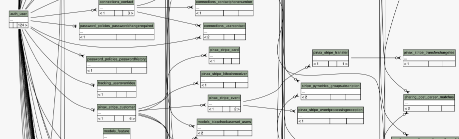
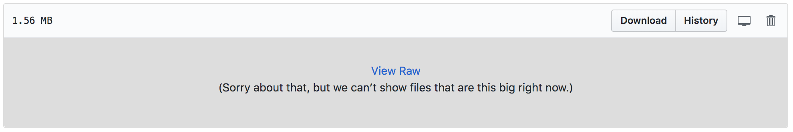
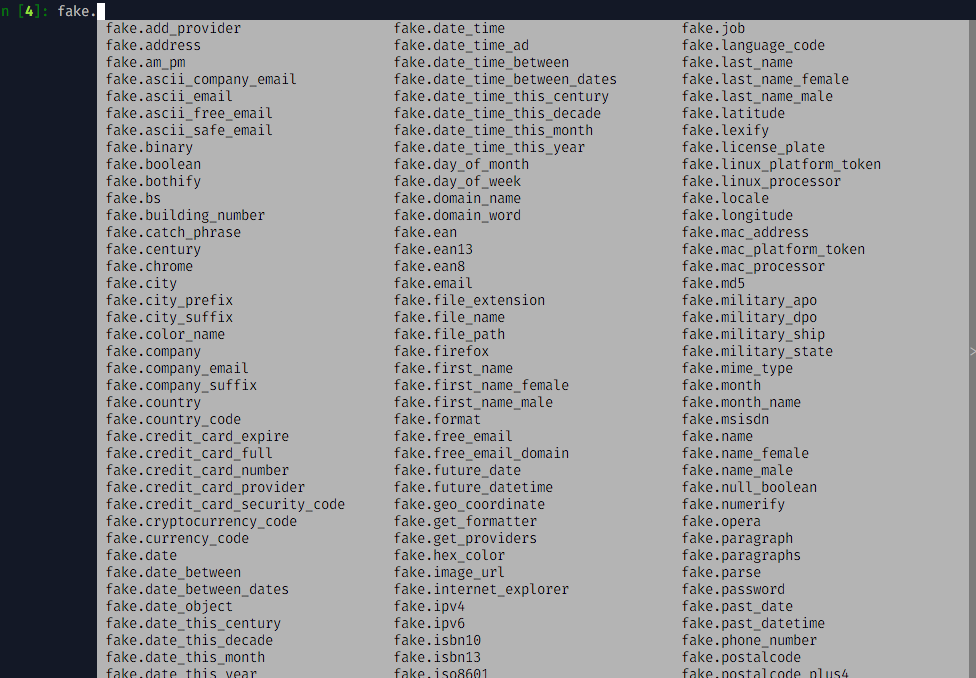

:title: Tools for Testing
:css: style.css

A closer look at some tools which make writing tests fun!
(or a little less painful).

.. footer::

    .. image:: images/logo-icon.png

    http://github.com/pymetrics

----

In the beginning, there was nothing
===================================

The test database is created with mostly* nothing in it.

But we need to test... **stuff**.

----

Creating objects
================

It's not like we can't create things:

.. include:: src/snippets/create.py
    :code: python

----

It Just Sucks...
================

Becuase real-world models have complex relationships which are annoying
to recreate

Especially when your dependency graph looks like this!

(yes, this is real, and only a very, very small portion of our schema!)

----

There are Fixtures...
=====================

These are brittle and hard to maintain.

They're OK for initial data dependencies, sometimes. Lists of countries, or
state codes for example. Things that don't change often.

Otherwise, avoid these!!!

----

factory_boy
===========

    factory_boy is a fixtures replacement based on thoughtbot’s factory_bot.

.. code:: python

    class FooTests(unittest.TestCase):

        def test_with_factory_boy(self):
            # We need a 200€, paid order, shipping to australia, for a VIP customer
            order = OrderFactory(
                amount=200,
                status='PAID',
                customer__is_vip=True,
                address__country='AU',
            )
            # Run the tests here

        def test_without_factory_boy(self):
            address = Address(
                street="42 fubar street",
                zipcode="42Z42",
                city="Sydney",
                country="AU",
            )
            customer = Customer(
                first_name="John",
                last_name="Doe",
                phone="+1234",
                email="john.doe@example.org",
                active=True,
                is_vip=True,
                address=address,
            )
            # etc.

http://factoryboy.readthedocs.io/en/latest/

----

Factories create model instances
================================

.. code:: python

    class UserFactory(factory.django.DjangoModelFactory):
        class Meta:
            model = models.User

        first_name = factory.Faker('first_name')
        last_name = factory.Faker('last_name')
        email = factory.LazyAttribute(lambda o: f"{o.first_name}.{o.last_name}@mailinator.com")
        admin = False

And handle relationships:

.. code:: python

    class PostFactory(factory.django.DjangoModelFactory):
        class Meta:
            model = models.Post

        author = factory.SubFactory(UserFactory)

``PostFactory`` will automatically create an ``author``:

.. code::

    >>> post = PostFactory.build()
    >>> post.author.first_name
    'Betty'

----

Random, but defined, data
=========================

Factory boy integrations the ``faker`` library, which provides many types
of fake, well-formed data:

.. code::

    In [6]: fake.catch_phrase()
    Out[6]: u'Reduced global architecture'

    In [7]: fake.first_name_female()
    Out[7]: u'Stephanie'

    In [8]: fake.credit_card_number()
    Out[8]: u'6011768725405241'

    In [9]: fake.date_time_this_month(before_now=True)
    Out[9]: datetime.datetime(2018, 3, 7, 8, 1, 53)

    In [10]: fake.company()
    Out[10]: u'Warren Inc'

    In [11]: fake.cryptocurrency_code()
    Out[11]: 'XDN'

----

There are many providers
========================

----

Create, Instantiate, or just get some attributes:
=================================================

Don't hit the DB when you don't need to!

.. code:: python

    # Returns a User instance that's not saved
    user = UserFactory.build()

    # Returns a saved User instance
    user = UserFactory.create()

    # Returns a stub object (just a bunch of attributes)
    obj = UserFactory.stub()

----

Example: Testing a ``ModelForm``
================================

Using factory boy to generate a dict

.. code::

    >>> factory.build(dict, FACTORY_CLASS=UserFactory)
    {'first_name': "Agent 001", 'username': 'john_doe'}

This can be useful to testing things like Forms and API endpoints:

.. code:: python

    # tests.py
    class OrderFormTests(SimpleTestCase):
        def test_order_form_happy_path(self):
            order_info = factory.build(dict, FACTORY_CLASS=OrderFactory)
            form = OrderForm(order_info)
            self.assertTrue(form.is_valid())

----

Lots of examples are available:
===============================

Check out the Common Recipes section of the docs for more complex examples

.. code:: python

    # Here's what we want:
    # The User to have the lang of its country (factory.SelfAttribute('country.lang'))
    # The Company owner to live in the country of the company (factory.SelfAttribute('..country'))

    # factories.py
    class CountryFactory(factory.django.DjangoModelFactory):
        class Meta:
            model = models.Country

        name = factory.Iterator(["France", "Italy", "Spain"])
        lang = factory.Iterator(['fr', 'it', 'es'])

    class UserFactory(factory.django.DjangoModelFactory):
        class Meta:
            model = models.User

        name = "John"
        lang = factory.SelfAttribute('country.lang')
        country = factory.SubFactory(CountryFactory)

    class CompanyFactory(factory.django.DjangoModelFactory):
        class Meta:
            model = models.Company

        name = "ACME, Inc."
        country = factory.SubFactory(CountryFactory)
        owner = factory.SubFactory(UserFactory, country=factory.SelfAttribute('..country'))

http://factoryboy.readthedocs.io/en/latest/recipes.html

----

Request Mock
============

https://requests-mock.readthedocs.io/en/latest/overview.html

    The requests-mock library at its core is simply a transport adapter that
    can be preloaded with responses that are returned if certain URIs are
    requested.

In other words, when your code uses ``requests``, your tests can use
``requests_mock`` to replace the actual request with a response you design

----

Remember our ``CoinAccount`` class?
===================================

.. include:: src/coinbot/accounts/models/account.py
    :code: python

Note that call to ``coinbase.get_price``. It looks like this:

.. include:: src/coinbot/coinbase.py
    :code: python

----

Our previous test
=================

Previously, we mocked the entire ``get_price`` function:

.. include:: src/coinbot/accounts/tests/test_get_balance_in_fiat.py
    :code: python

This is OK, but not the greatest. If model had the call signature wrong,
the mock wouldn't care.

It *would* remember how it was called, and we could check, but that makes
our tests brittle.

----

Instead, we can simply short-circuit the request:

.. include:: src/coinbot/accounts/tests/test_get_account_request_mock.py
    :code: python

``get_price`` code for reference:

.. include:: src/coinbot/coinbase.py
    :code: python
